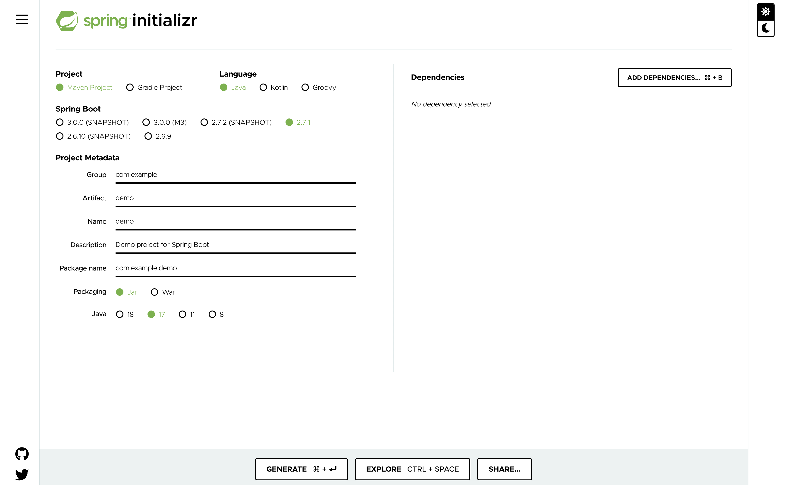

The quickest way of getting start with Spring Boot is to use
[start.spring.io](https://start.spring.io/). This web site hosts Spring
Initializr, a web application designed to help bootstrap your Spring Boot
projects.

The Spring Initializr application allows you to enter the name of your
application, the tooling you want to use, and any dependencies. When you click
on generate it will automatically start a download of application source code
for a Spring Boot application satisfying those requirements. You can then unpack
that on your local computer and start working.
